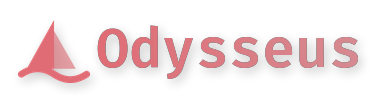

<p align="center">
  
</p>

<p align="center">
  A self-hosted AI workspace — chat, agents, research, documents, email, notes and calendar —
  <br>
  extended here with a <b>spaced-repetition Study system</b> and a <b>multi-agent Omnigent bridge</b>.
</p>

<p align="center">
  <a href="#quick-start">Quick Start</a> ·
  <a href="#bring-your-own-api-key">Bring your own API key</a> ·
  <a href="#the-study-app">Study</a> ·
  <a href="#omnigent">Omnigent</a> ·
  <a href="website/setup.md">Setup Guide</a> ·
  <a href="CONTRIBUTING.md">Contributing</a>
</p>

<p align="center">
  
</p>

---

## What this fork is

This is a fork of [**odysseus-dev/odysseus**](https://github.com/odysseus-dev/odysseus).
Everything upstream does, this does — see [Upstream features](#upstream-features).

On top of that it adds two things:

| Addition | What it is |
| --- | --- |
| **[Study](#the-study-app)** | A spaced-repetition study system. Feed it your course PDFs and past papers; it extracts the questions, groups them into chapters and themes, and drills you on them with FSRS scheduling, confidence calibration, AI grading of written answers, and hints that cost you. |
| **[Omnigent](#omnigent)** | A multi-agent orchestrator bundled into the image and bridged into the UI, so agent crews (including Claude Code and Codex as sub-agents) run alongside the workspace. |

Upstream is the place to go for the core workspace. Come here for Study and Omnigent.

## Quick Start

Requires [Docker](https://docs.docker.com/get-docker/) with Compose, and nothing else:
Python and Node live in the image, and the models are whatever you point it at.

```bash
git clone https://github.com/BestMiraPro/Odysseus-expanded-AI-superapp.git
cd Odysseus-expanded-AI-superapp
cp .env.example .env
docker compose up -d --build
```

Or let a script do it: it clones on a fresh machine, fast-forwards an existing clone
to `main` (and refuses if you have uncommitted changes), rebuilds, waits for the app to
answer, and prints the first-run admin password. Your `data/` is kept.

```powershell
# Windows (PowerShell)
irm https://raw.githubusercontent.com/BestMiraPro/Odysseus-expanded-AI-superapp/main/deploy-main.ps1 | iex
```

```bash
# Linux / macOS
curl -fsSL https://raw.githubusercontent.com/BestMiraPro/Odysseus-expanded-AI-superapp/main/deploy-main.sh | bash
```

Run it again any time to update. From a clone, `./deploy-main.ps1` / `./deploy-main.sh`
does the same in that folder.

The first build takes a while (it bakes in Omnigent, the Claude Code and Codex CLIs,
and the image-model wheels). When it finishes:

1. Open **http://localhost:7000**.
2. Get your generated admin password:

   ```bash
   docker compose logs odysseus | grep -A1 "Initial admin user"
   ```

   It logs `Temporary password: …` once, on first boot only. Log in as `admin` and
   change it under Settings → Account.
3. Give it a model — see below. Nothing AI-powered works until you do.

> The default branch is `dev` and gets changes first. `main` is the same content,
> promoted only after a full green test run.

## Bring your own API key

Odysseus talks to anything that speaks the **OpenAI-compatible chat-completions API**, so
most providers work, and so does anything you run locally. Anthropic's Messages API and
Ollama's native API are detected and handled directly, so those work too. Keys are entered
**in the UI, not in `.env`** — they are stored per endpoint, and one key can back several
models.

**Settings → Services → Add API Models (Endpoint)**

1. Give the endpoint a name (e.g. `OpenAI`, `OpenRouter`, `Together`, `W&B`).
2. Paste the base URL. For OpenAI-compatible providers this is the part ending in
   `/v1`; Anthropic and Ollama are recognised from their host and need no suffix.

   | Provider | Base URL |
   | --- | --- |
   | OpenAI | `https://api.openai.com/v1` |
   | OpenRouter | `https://openrouter.ai/api/v1` |
   | Together | `https://api.together.xyz/v1` |
   | Groq | `https://api.groq.com/openai/v1` |
   | Anthropic | `https://api.anthropic.com` |
   | Local (Ollama) | `http://host.docker.internal:11434/v1` |
   | Local (LM Studio / vLLM / llama.cpp) | `http://host.docker.internal:1234/v1` |

3. Paste your API key and press **Test**. It fetches the model list, which is how you
   know the key and URL are both right.
4. Save, then pick which model does what in **Settings → Services**:

   | Setting | Used for |
   | --- | --- |
   | **Default Chat Model** | new chat sessions |
   | **Utility Model** | background work — summaries, auto-naming, memory retrieval. A small/cheap or local model is the point here. |
   | **Study Model** | question extraction, chapter/theme grouping, answer grading, hints |
   | **Vision** | anything involving images, including scanned PDFs in Study |

   Leave any of them unset and it falls back: Study → Utility → Default Chat. So one
   configured endpoint is enough to try everything.

Running fully local? Point the endpoint at Ollama or LM Studio instead of a hosted
provider and skip the key — the rest of the app does not care which it is.

## The Study app

**Tools → Study** in the left sidebar. (It has no rail shortcut; it lives in the Tools list.)

The loop it is built around:

1. **Subjects** — make a subject, then attach material: lecture notes, textbook chapters,
   past papers. PDFs, text and images all work; scanned PDFs go through vision OCR.
2. **Extract questions** — the model reads the material and pulls out the actual
   questions, with their answers, options, difficulty and source page. Extraction also
   groups the bank into chapters and themes as it goes, so it is ready to practise.
3. **Practice** — pick everything, one chapter, or one theme. You state your confidence
   *before* checking, which is what makes the "sure but wrong" count at the end useful.
   Written answers are graded by the model against the source; hints are available but
   reschedule a success sooner.
4. **Review, Plan, Stats** — FSRS scheduling decides what is due. Add an exam date and it
   builds a spaced, interleaved plan, including timed mocks that ask you to predict your
   score before marking.

There is also a **Tutor** tab — an agent grounded in your own materials, so it answers
from your notes rather than from the internet.

Which model Study uses is shown in the panel header (`Model: …`); click it to change it,
or set it in Settings → Services → Study Model.

## AI Council

**Council** in the left rail, or **Tools → Council** (also `/council`). Put one question to
several models at once:

1. **Opinions** — every seated model answers on its own, streamed side by side.
2. **Peer review** (Full mode) — each model ranks the others' answers without knowing who
   wrote them; a model's vote on its own answer is not counted.
3. **Synthesis** — the chairman model writes one answer from the answers, reviews and ranking.

Seats can be any model in Odysseus: API endpoints, local models, and your **Claude** and
**ChatGPT** subscriptions. Both subscriptions connect from the Council page (or Settings →
Models) and then work everywhere else in Odysseus too — chat, Study, research.

- **ChatGPT** — OpenAI account sign-in with a device code, the same flow as
  Settings → Models → ChatGPT Subscription.
- **Claude** — runs through the official Claude Code CLI on the Odysseus host
  (`npm install -g @anthropic-ai/claude-code`). Either run `claude setup-token` and paste
  the token, or use the Claude login already on that machine (`claude auth login`).
  Anthropic only allows subscription sign-ins inside Claude Code itself, so Odysseus drives
  the CLI rather than calling the API with your subscription token. Text only: no tools or
  images on these seats.

Runs live on the server: closing the page does not stop a council, and reopening the thread
shows the saved result. Follow-up questions in the same thread see the earlier answers.

## Omnigent

**Omnigent** in the left rail, or **Tools → Omnigent**. Its own web UI is bridged to
**http://localhost:6868**.

It runs one **universal crew** (`crew`). You pick its **orchestrator** in the Omnigent panel:
Claude Code, Codex, or any API or local model you configured. Every other model is on the
crew's roster as a sub-agent:

- **API and local models** — everything configured above, including keyless local servers
  (Ollama, LM Studio). No extra login.
- **Claude Code** and **Codex** — both CLIs are baked into the image so they can act as
  native sub-agents. Each needs a one-time interactive subscription login inside the
  container; the API-model workers need none.

The orchestrator's prompt lists each worker with its tier (fast / balanced / flagship), what
it is good at, ★ **recommended** (the newest model of its family) and its price per million
tokens, so it can send routine work to cheap fast models and hard work to flagships. The panel
shows the same roster; **Apply** rewrites the crew and restarts a running server, **Re-sync
models** picks up new endpoints and keys, and **Max API workers** caps the roster.

Launching Omnigent is admin-only: its agents run unsandboxed with a shell where Odysseus runs.

Pin the version with `OMNIGENT_VERSION` in the Dockerfile (currently 0.16.0), and move the
bridged port with `OMNIGENT_UI_PORT` in `.env` if 6868 is taken.

## Models: recommended, cost, and delegation

Every model picker (chat, Council, Omnigent) marks the **★ recommended** model of each family
and shows a price band (`$`–`$$$$` metered, `plan` for subscriptions, `free` for local).
Prices come from your own `data/omnigent-model-costs.json` when you declare them, otherwise
from OpenRouter's public model list (cached daily; set `ODYSSEUS_MODEL_PRICES=off` to never
fetch it). An unmatched model says "price unknown" rather than guessing.

In agent mode any chat model can use any other model as a sub-agent: `list_models` shows the
roster with recommendations and prices, and `chat_with_model` delegates a subtask (optionally
with its own instructions) to the model the agent picks. `ask_teacher auto` uses a
recommended flagship when no teacher model is set. Asking for this in plain words ("ask the
local model", "get a second opinion from GPT", "which models can you use?") is enough.

Sending your chat to another model is network egress, so once untrusted text is in the turn
(MCP tool descriptions, a provider's model list, a web page) Odysseus asks before delegating.
Choose **Allow for this chat session** once and later delegations in that chat run without asking.

## Budget

**Settings → Budget** shows what pay-per-token API models cost you this month. It breaks the total down by
source (chat, agent, delegations, Council) and by model, and projects the month-end total.
Subscription (Claude, ChatGPT, Copilot) and local models cost nothing per call. They are never counted or
blocked.

- **Monthly cap.** When metered spend reaches it, *Block* refuses new metered chats, Council turns and
  delegations until the month ends (UTC). *Warn* lets them run and shows a banner. A banner appears above the chat from 80% of the cap.
- **Ask before one action above $X.**
  - A Council turn whose estimate is over this asks you first. The Council shows the estimate under the
    question box as you type. The estimate starts from typical reply lengths, then learns your own after
    a few turns.
  - An agent delegation over the limit is refused and the agent is offered cheaper models, since an agent
    cannot approve its own spend.

Costs use the same prices as the model pickers. A model with no known price is listed as unpriced rather
than guessed. Rows marked ≈ were estimated from text length because the provider reported no token counts.

What counts:
- Chat, and agent rounds (scheduled agent tasks included).
- Agent delegations (`chat_with_model`, `ask_teacher`, `pipeline`, `send_to_session`).
- Council turns.
- Research jobs (deep research and inline research), call by call.
- Study: card and question generation, grading, imports and the Study tutor.

Each agent round is billed when it ends, so a turn you stop is still counted, and a long agent turn stops
at the cap. Research and Study calls are checked one by one, so a long research job stops at the cap
too. The default single-action limit is $1. Requests running at the same moment can each pass the
check before the others are recorded, so the cap can be overshot by about one turn's cost.

Chat titles, memory extraction and Omnigent are not counted yet.

## Moving to another machine

Your whole Study app moves between Odysseus installs: subjects, flashcards with their
scheduling state, practice questions, materials and their PDFs and figures, exams and
plans, focus sessions, the full review and attempt history, fitted FSRS weights and
Study chats. Only the new machine needs this version (see the next paragraph).

Everything lives in **Settings → System → Transfer From Another Machine**.

### With a file (no network between the machines)

1. **On the old machine:** **Download Study Bundle**. You get one `.zip`.
2. Carry it over on a USB stick or your own cloud drive.
3. **On the new machine:** **Import Study Bundle** and pick the file. It shows what is
   new and asks before writing anything.

**Old machine on an older version?** It does not need updating. Stop Odysseus there, zip
its whole `data` folder (Windows: right-click → *Send to → Compressed (zipped) folder*;
Mac: right-click → *Compress*) and import that zip with the same button. The importer
reads the Study tables straight out of the copied `app.db` (older schemas are fine) and
finds the PDFs and figures under `uploads/`. If that database holds several users' Study
data, it asks whose to import.

Neither machine accepts a connection from the other, so this is the way on a shared or
public network. The bundle holds your study data unencrypted, so delete it once it is
imported. Memories, skills and settings go the same way with **Data Backup → Export
Data / Import Data** on the same page.

### Over the network (optional)

Only when the old machine is reachable from the new one on a network you trust (home
LAN, Tailscale). On the old machine press **Create Transfer Token**; on the new one enter
the old machine's address (e.g. `http://192.168.1.20:7000`) and the token, then **Pull
Study Data** and/or **Pull Memories**. The token is sent with each request; revoke it on
the source once you are done.

### Either way

Nothing on the new machine is overwritten: anything already there is skipped, so
importing again later only brings over what is new and retries any PDF that failed to
copy. Everything lands under the user doing the import. If the database part fails it is
rolled back whole.

To move *everything* (chats, documents, email, settings too) onto a fresh machine, use
`scripts/odysseus-backup snapshot` on the old one and `restore` on the new one instead.

## Upstream features

Everything from [odysseus-dev/odysseus](https://github.com/odysseus-dev/odysseus):

- **Chat + Agents** — local/API models, tools, MCP, files, shell, skills, and memory.
- **Cookbook** — hardware-aware model recommendations, downloads, and serving.
- **Deep Research** — multi-step web research with source reading and report generation.
- **Compare** — blind side-by-side model testing and synthesis.
- **Documents** — writing-first editor with AI edits, suggestions, Markdown, HTML and CSV.
- **Email** — IMAP/SMTP inbox with triage, tags, summaries, reminders, and reply drafts.
- **Notes, Tasks + Calendar** — reminders, todos, scheduled agent tasks, and CalDAV sync.
- **Extras** — gallery/image editor, themes, uploads, web search, presets, sessions, 2FA.

Upstream's hover-to-play tour is on the
[Odysseus landing page](https://odysseus-dev.github.io/odysseus/).

## Going further

- **[Setup guide](website/setup.md)** — native installs, GPU passthrough, Windows and
  macOS, HTTPS, reverse proxies, and the full configuration reference.
- **[DEPLOY.md](DEPLOY.md)** — the `deploy.ps1` build-from-a-clean-branch workflow.
- **[CONTRIBUTING.md](CONTRIBUTING.md)** and **[ROADMAP.md](ROADMAP.md)**.

## Security

Self-hosted, with real tools attached — treat it like something that can act on your behalf.

- Keep `AUTH_ENABLED=true` for any network-accessible deployment.
- Keep `LOCALHOST_BYPASS=false` outside local development.
- Keep private data out of Git. `.env`, `data/` and credential files are gitignored;
  a CI job scans the whole history for anything that slips through.
- Do not publish raw model/service ports (7000, 6868, 8100, …) straight to the internet.

See [SECURITY.md](SECURITY.md) and [THREAT_MODEL.md](THREAT_MODEL.md); deployment
specifics are in the [setup guide](website/setup.md#security-notes).

## License

AGPL-3.0-or-later, inherited from upstream — see [LICENSE](LICENSE) and
[ACKNOWLEDGMENTS.md](ACKNOWLEDGMENTS.md). Upstream Odysseus is the work of
[odysseus-dev](https://github.com/odysseus-dev/odysseus) and its contributors.
